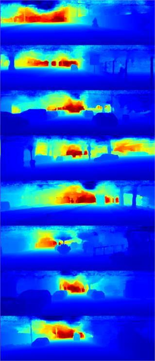

# FCFRNet(AAAI2021)
A paddle implementation of the paper FCFRNet:A paddle implementation of the paper FCFRNet: Fusion based Coarse-to-Fine Residual Learning for Monocular Depth Completion, 
[\[AAAI 2021\]](https://openaccess.thecvf.com/content/CVPR2021/html/Shen_CFNet_Cascade_and_Fused_Cost_Volume_for_Robust_Stereo_Matching_CVPR_2021_paper.html)


| rgb            | input depth            | pred dense dpeth        | groundtruth            |
|----------------|------------------------|-------------------------|------------------------|
|  |  |  |  |


</font>

## Abstract
Depth completion aims to recover a dense depth map from a sparse depth map with the corresponding color image as input. Recent approaches mainly formulate the depth completion as a one-stage end-to-end learning task, which outputs dense depth maps directly. However, the feature extraction and supervision in one-stage frameworks are insufficient,limiting the performance of these approaches. To address this problem, we propose a novel end-to-end residual learning framework, which formulates the depth completion as a twostage learning task, i.e., a sparse-to-coarse stage and a coarseto-fine stage. First, a coarse dense depth map is obtained by a simple CNN framework. Then, a refined depth map is further obtained using a residual learning strategy in the coarse-tofine stage with coarse depth map and color image as input. Specially, in the coarse-to-fine stage, a channel shuffle extraction operation is utilized to extract more representative features from color image and coarse depth map, and an energy based fusion operation is exploited to effectively fuse these features obtained by channel shuffle operation, thus leading to more accurate and refined depth maps. We achieve SoTA performance in RMSE on KITTI benchmark. Extensive experiments on other datasets future demonstrate the superiority of our approach over current state-of-the-art depth completion approaches.


## Evaluation

**Important**:for evaluation , you need to download sparse to coarse depth image from [this](https://aistudio.baidu.com/aistudio/datasetdetail/175535/0)
.you need it to replace sparse depth input image.Besides,you aslo need to download weight from [this](https://aistudio.baidu.com/aistudio/datasetdetail/176607)

you can run this 
```bash
python train.py -c ./model_document/FCFRNet/FCFRNet.yaml
```


## Models

[Pretrained Model](https://aistudio.baidu.com/aistudio/datasetdetail/176607)
You can use this checkpoint to reproduce the result reported in Table.3 of the main paper


